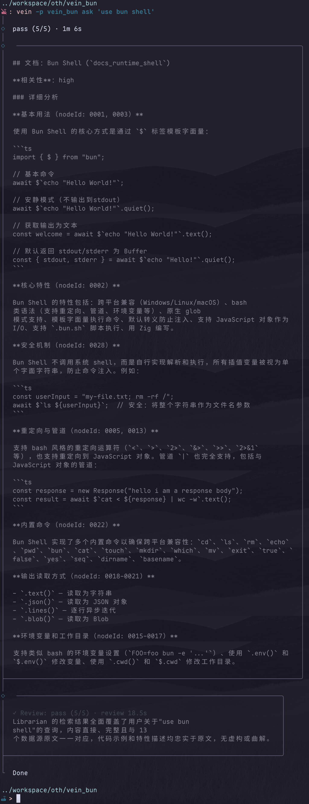
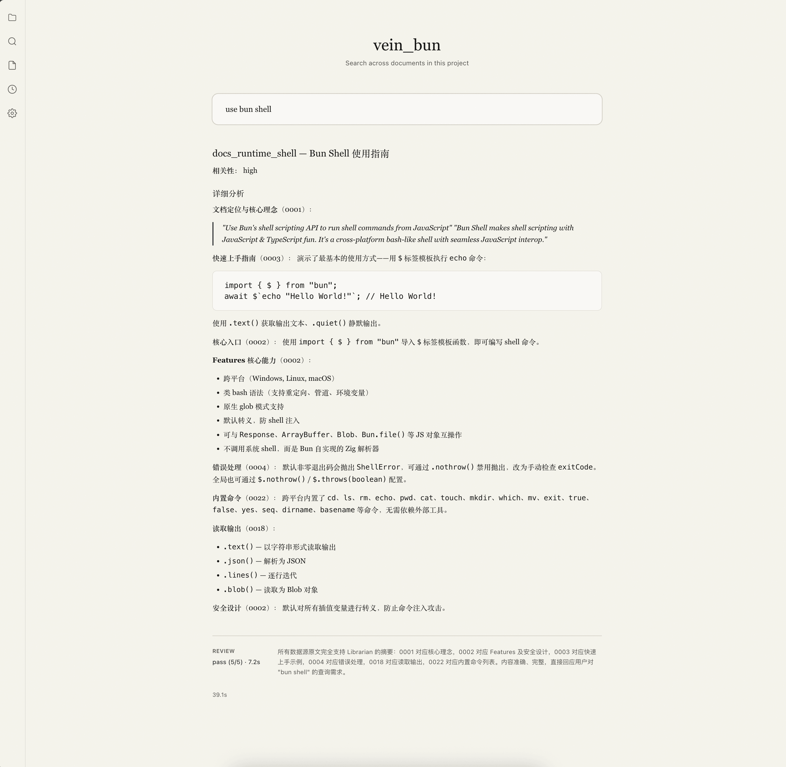

<h1 align="center">Vein</h1>

<p align="center">
  <strong>AI Agent 驱动的本地文档管理与智能检索系统</strong><br/>
  分词搜索直达文档，AI 代理深入原文——把个人知识库变成可对话的第二大脑。
</p>

<p align="center">
  
  
  
  
</p>

<p align="center">
  
  
</p>

---

## 📑 目录

- [⚡ 快速开始](#-快速开始)
- [✨ 核心理念](#-核心理念)
- [🎯 功能特性](#-功能特性)
- [📖 命令一览](#-命令一览)
- [🏗️ 架构设计](#-架构设计)
- [🔧 配置](#-配置)
- [🛠️ 技术栈](#-技术栈)
- [📄 许可](#-许可)

---

## ⚡ 快速开始

### 前置要求

- **Node.js** ≥ 18（生产运行）
- **Bun** ≥ 1.0（开发 / 从源码构建）
- 一个可用的 AI 模型 API Key（由**pi**驱动）

### 安装

```bash
# 克隆仓库
git clone https://github.com/vhxnif/vein.git
cd vein

# 安装依赖（Bun workspaces）
bun install

# 构建并全局 link（Bun 构建 → Node.js 运行）
bun run link
```

### 初始化项目

```bash
# 在当前目录创建 Vein 项目
vein new my-knowledge-base
```

交互式引导会帮你设置项目名称、AI provider 和模型。初始化完成后自动写入 `~/.config/vein/projects.json` 全局注册表。

### 导入文档

```bash
# 导入 Markdown 文档（自动生成 AI 摘要 + 中文分词索引）
vein markdown docs/*.md

# 强制重新导入（覆盖已有）
vein markdown docs/*.md --force
```

### 开始检索

```bash
# 交互式问答
vein ask "这个项目里关于部署的文档有哪些？"

# 查看历史
vein history --last
```

### 跨目录操作

```bash
# 从任意目录直接操作已注册的项目
vein -p my-knowledge-base ask "检索 API 设计文档"
```

---

## ✨ 核心理念

传统全文搜索只能按关键词匹配，你得到一堆零散片段。**Vein** 的工作方式不同：

```
你的问题
   │
   ▼
关键词分词搜索 ──→ 定位到具体文档
   │
   ▼
AI Agent 深入文档节点 ──→ 阅读原文、理解上下文
   │
   ▼
汇总分析 + 自检审查 ──→ 结构化答案（附数据来源）
```

**不是搜文档，是让 AI 替你读文档。**

---

## 🎯 功能特性

| 特性 | 说明 |
|------|------|
| 🔍 **中文分词搜索** | LLM 驱动的中文分词 + SQLite FTS5 BM25 排序，精准匹配中文语义 |
| 🤖 **多 Agent 协作检索** | 主 Agent 搜索 + 子 Agent 逐文档深度分析 + Reviewer 自检审查 |
| 🌲 **文档树形结构** | Markdown 自动拆分为节点树，支持层级浏览和精准定位 |
| 💾 **项目级配置** | 每个项目独立 `.vein/config.json`，可为分词/摘要/检索配置不同模型 |
| 🌐 **全局项目注册表** | `vein -p <name>` 从任意目录操作已注册项目 |
| 📝 **查询历史** | 每次 `ask` 自动保存到 `.vein/ask-history/`，可回溯浏览 |
| 🗃️ **LLM 缓存** | `model_cache` 表缓存分词和摘要结果，避免重复调用 |
| 🚀 **批量导入并发** | Phase 1 4 文件并行 LLM 处理 + Phase 2 串行 DB 写入（WAL 优化） |
| 🖥️ **交互式 CLI** | 基于 `@clack/prompts` 的友好交互界面，支持非交互 JSON 模式 |
| 🌐 **Web UI** | 浏览器端全功能界面，实时 SSE 检索进度、文档树浏览、项目配置 |

---

## 📖 命令一览

| 命令 | 别名 | 功能 |
|------|------|------|
| `vein new [name]` | — | 初始化新项目，交互式配置 |
| `vein markdown <files...>` | — | 导入 Markdown 文档，自动摘要 + 分词 |
| `vein markdown resegment` | `rs` | 重新分词所有文档的 FTS 索引 |
| `vein ask [query]` | — | AI Agent 检索文档库 |
| `vein history` | `hs` | 浏览历史问答记录 |
| `vein browse` | `br` | 交互式浏览文档库 |
| `vein projects` | `pr` | 管理全局项目注册表 |
| `vein web` | — | 启动 Web UI 服务 |
| `vein config` | — | 交互式修改项目配置 |

**常用选项：**

```bash
-p, --project <name>   指定目标项目（从全局注册表查找）
-n, --no-interactive   输出 JSON（脚本用）
-t, --trace            展示检索步骤追踪
-f, --force            强制重新导入
```

---

## 🌐 Web UI

除了 CLI，Vein 还提供了一个基于浏览器的 Web 界面，支持所有核心功能。

### 启动

```bash
# 开发模式（构建后端 + Node.js 运行）
bun run dev:web

# 全局安装后一键启动
vein web
vein web --port 8080

# 生产构建
bun run build:web
```

- API 服务器运行在 `http://localhost:3000`
- 前端开发服务器 `bun run --filter @vein/web dev:frontend`（`http://localhost:5173`，Vite HMR，自动代理 API）

生产模式下，Hono 服务器在 `:3000` 同时提供 API 和前端静态文件。

### 功能

| 页面 | 功能 |
|------|------|
| **Home** | 项目检索入口：输入查询 → 实时 SSE 进度流 → Markdown 结果 + Review 自检 |
| **Ask** | 同 Home，AI 检索核心页面 |
| **Docs** | 文档列表（响应式分页/无限滚动）、文档详情（大纲树 + Markdown 渲染）、导入（拖放+进度）/删除 |
| **History** | 查询历史（按日期分组）、展开查看完整问答 |
| **Settings** | 项目配置（名称、主模型、摘要模型、分词模型） |

Web UI 采用 [Kami](https://github.com/tw93/Kami) 设计语言：暖色羊皮纸底、墨水蓝单色强调、Serif 排版层级，界面如印刷品般克制优雅。

### 技术栈

| 层 | 技术 |
|---|------|
| **API 服务** | Hono（路由、CORS、SSE 流式响应） |
| **前端框架** | React 19 + Vite |
| **数据管理** | TanStack Query（服务端状态缓存）+ TanStack Router（类型安全路由） |
| **样式** | Tailwind CSS v4 + Kami 设计令牌（CSS 变量） |
| **AI 后端** | 复用 `@vein/core` 全部业务能力 |

---

## 🏗️ 架构设计

### 包结构（Monorepo）

```
vein/
├── packages/
│   ├── core/          # @vein/core — 业务层（AI / DB / 文档树 / 配置）
│   ├── cli/           # @vein/cli — thin client（命令解析 + 交互 I/O）
│   └── web/           # @vein/web — Web UI（Hono API + React SPA）
├── package.json       # workspace 根
└── biome.json         # 代码规范
```

- **Core**：提供完整业务能力（`@vein/core` 单一入口），CLI / 未来 Web 模块只调用高层 API
- **CLI**：不直接访问 store / pi-ai / 文件系统，所有逻辑委托给 core

### 数据模型

```
library（逻辑概念，对应 nodes 子树）
  └── docs（文档）
        ├── nodes（文档节点，树形结构 + 闭包表）
        └── docs_fts（FTS5 unicode61 全文索引）
```

### 检索流程：主 Agent + 子 Agent 委托

```
User Query
  │
  ▼
Main Librarian Agent (主 Agent)
  ├─ searchDocsByKeyword(query)          → 结果少时自动换词重搜
  ├─ analyzeDocument(docId, userQuery)   → 一次性并发 10 个子 Agent
  │                                                │
  │                                                ▼
  │                                    Document Analyzer (子 Agent)
  │                                    ├─ getDocStructure(docId)
  │                                    └─ getDocNodeDetails(docId, nodeId)
  │                                                │
  │                                                └───────────┘
  │                                         返回 Markdown 分析报告
  └─ reviewResult(query, answer, sources) → 审查前自查覆盖度，getReviewSource 并行验证
```

### 批量导入管道

```
Phase 1 — 并行 LLM（4 文件并发）
  readFile → mdToTree（解析 + LLM 摘要）→ segmentText（LLM 分词）
         ↓
Phase 2 — 串行 DB（WAL 模式）
  insertTree → insertDoc（含 docs_fts）
```

---

---

## 🔧 配置

项目配置文件 `.vein/config.json`：

```json
{
  "$schema": "./config.schema.json",
  "name": "my-knowledge-base",
  "db": ".vein/data.db",
  "model": {
    "provider": "deepseek",
    "model": "deepseek-v4-pro"
  },
  "summarizer": {
    "provider": "openai",
    "model": "gpt-4o-mini"
  },
  "segmenter": {
    "provider": "openai",
    "model": "gpt-4o-mini"
  },
  "subagent": {
    "provider": "openai",
    "model": "gpt-4o-mini"
  },
  "reviewer": {
    "provider": "openai",
    "model": "gpt-4o"
  }
}
```

| 字段 | 说明 |
|------|------|
| `model` | 主检索 Agent 使用的模型 |
| `summarizer` | 文档摘要专用模型（可选，回退到 `model`） |
| `segmenter` | 中文分词专用模型（可选，回退到 `model`） |
| `subagent` | 子 Agent 分析专用模型（可选，回退到 `model`） |
| `reviewer` | 结果审查专用模型（可选，回退到 `model`） |
| `db` | SQLite 数据库文件路径 |

AI Provider 通过 `@earendil-works/pi-ai` 统一适配，支持 OpenAI / DeepSeek 及兼容接口。

---

## 🛠️ 技术栈

| 层级 | 技术 |
|------|------|
| **运行时** | Node.js（开发用 Bun 运行 TS 源码） |
| **包管理** | Bun workspaces（monorepo） |
| **数据库** | SQLite (better-sqlite3, WAL 模式) |
| **ORM** | Drizzle ORM |
| **全文搜索** | FTS5 unicode61 + BM25 排序 |
| **AI 框架** | `@earendil-works/pi-ai` + `@earendil-works/pi-agent-core` |
| **CLI** | Commander + @clack/prompts |
| **日志** | Pino（结构化 JSON，按日滚动） |
| **代码规范** | Biome (lint + format) |
| **构建** | Bun build → Node.js 单文件 |

---

## 📄 许可

MIT License © 2025 [vhxnif](https://github.com/vhxnif)

---

<p align="center">
  <sub>Built with ❤️ using Bun, SQLite, and LLMs</sub>
</p>
